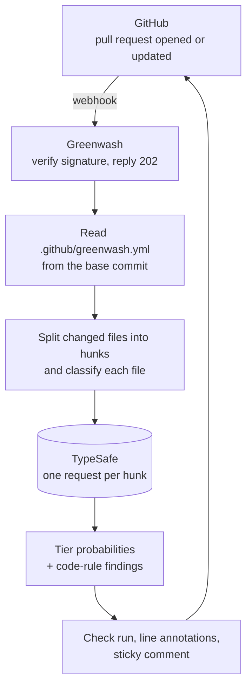

# 🧪 Greenwash

**A GitHub App that catches AI coding agents cheating to make CI green.**

[](https://github.com/ayushgml/greenwash-oss/actions/workflows/ci.yml)
[](LICENSE)


When a coding agent can't fix a failing build, it sometimes makes the build pass anyway. It
weakens an assertion, skips the test, hard-codes the answer the test expects, or marks the CI
step as non-blocking. The build turns green and the reviewer moves on.

Greenwash reads every changed hunk of every pull request and asks narrow yes/no questions about
it — *"does this delete a test assertion or replace it with a weaker one?"* — using
[TypeSafe](https://docs.typesafe.ai)'s structured-judgment models. Findings show up as a check
run with line annotations and a single pull request comment, each with a probability instead of
a verdict.

---

## What it catches

| Check | Looks at | Severity |
|---|---|---|
| Weakened test assertion | test files | critical |
| Test skipped or disabled | test files | critical |
| Expected value rewritten without a stated behavior change | test files | warning |
| Hard-coded answer for specific inputs | source files | critical |
| Logic replaced with a placeholder | source files | critical |
| Error silently swallowed | source files | warning |
| Type or lint check suppressed | source, test, lint/type config | warning |
| CI step removed or made non-blocking | CI config | critical |
| Test file deleted | removed test files | warning |
| Snapshot updated without any source change | snapshot/golden files | warning |

The last two are plain code rules. The other eight are questions answered by a model, and every
question and threshold lives in one file: [`src/greenwash/checks.py`](src/greenwash/checks.py).

You can add your own checks in plain English — see [Custom rules](docs/configuration.md#custom-rules).

## What a report looks like

On a pull request that skips a test, special-cases a test input, and loosens an assertion,
Greenwash posts:

> ### 🧪 Greenwash: 3 likely problems found
>
> Checked 4 changed hunks in 0.3s
>
> | | Check | Where | Probability |
> |---|---|---|---|
> | 🔴 | Test skipped or disabled | `tests/test_config.py#L45` | 99% |
> | 🔴 | Hard-coded answer for specific inputs | `src/greenwash/analyze.py#L23` | 98% |
> | 🔴 | Weakened test assertion | `tests/test_diff.py#L53` | 98% |
>
> <sub>Greenwash asks narrow yes/no questions about every changed hunk. Scores are probabilities, not verdicts — a flagged change may be intentional.</sub>

The same findings appear as annotations on the exact lines in the **Files changed** tab, and the
comment updates in place on every push.

## How it works



- **Flagged** when a probability reaches the check's threshold (default `0.8`).
- **Worth a second look** between `0.5` and the threshold.
- The default `comment` mode never fails the check. Opt into blocking with `mode: check`.
- If Greenwash itself fails, the check completes as `neutral` — it never blocks a merge because of its own error.

Read the full walkthrough in [docs/architecture.md](docs/architecture.md).

## Getting started

Greenwash is self-hosted: you register your own GitHub App and run the service with your own
TypeSafe API key.

**You need:**
- Python 3.13+ and [uv](https://docs.astral.sh/uv/) (or Docker)
- A [TypeSafe API key](https://console.typesafe.ai/settings/keys)
- A GitHub account to register the app under

**Run the tests:**

```bash
git clone https://github.com/ayushgml/greenwash-oss.git
cd greenwash-oss
uv sync
uv run pytest
```

**Deploy it:** follow [docs/self-hosting.md](docs/self-hosting.md). It covers registering the
GitHub App, the required permissions, environment variables, deploying with Docker or Railway,
and local development with webhook forwarding.

## Configuration

Add `.github/greenwash.yml` to a repository to tune it. The file is read from the pull request's
**base** commit, so a pull request cannot switch off its own checks.

```yaml
mode: comment              # or "check" to fail the check on critical findings
ignore_paths:
  - "docs/**"
disabled_checks:
  - swallowed_error
rules:
  - id: billing
    title: Billing logic changed
    question: "Does `hunk.diff` change how customers are charged, refunded, or invoiced?"
    applies_to: [source]
    severity: warning
```

Full reference: [docs/configuration.md](docs/configuration.md).

## Privacy and data

For each changed hunk, Greenwash sends TypeSafe the hunk's diff, the file path, and the pull
request's title and description. It does not send whole files, stores nothing, and has no
database. Findings live only on GitHub. Details: [docs/privacy.md](docs/privacy.md).

## Accuracy

Greenwash ships a labeled evaluation set: for every model-answered check, two examples of
greenwashing and two legitimate look-alike changes (32 cases). The current checks classify all 32
correctly on `jev-1.13.0` at the default thresholds.

That set is small and hand-written, so treat it as a regression suite rather than a measure of
real-world precision. Reports of false positives and misses are the most valuable contribution you
can make — use the [false positive / missed problem](https://github.com/ayushgml/greenwash-oss/issues/new/choose)
issue template. See [docs/evaluation.md](docs/evaluation.md) to run the evals yourself.

## Limitations

- GitHub only (no GitLab or Bitbucket yet).
- Each hunk is judged on its own, without the rest of the file or repository.
- Very large pull requests are capped at 300 hunks, and each hunk at 8,000 characters.
- Every finding is a probability. Intentional changes — like deliberately updating an expected
  value — can be flagged, and subtle cheating can be missed.

## Contributing

Contributions are welcome — new checks, evaluation cases, bug fixes, and docs. Start with
[CONTRIBUTING.md](CONTRIBUTING.md). Please follow the [Code of Conduct](CODE_OF_CONDUCT.md).

To report a security issue, see [SECURITY.md](SECURITY.md). Please don't open a public issue.

## License

[Apache License 2.0](LICENSE) © Ayush Gupta
