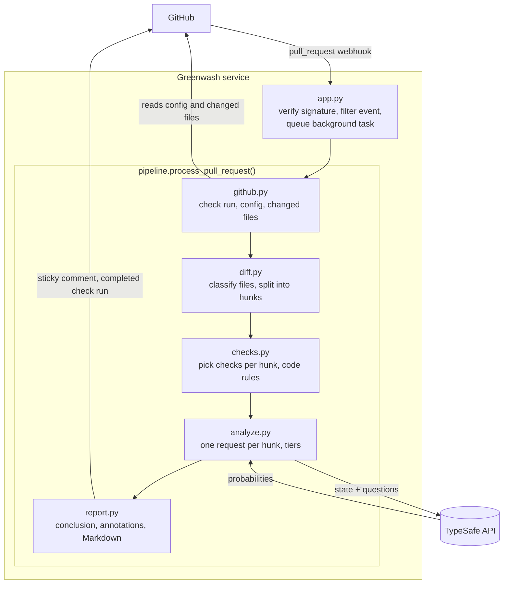
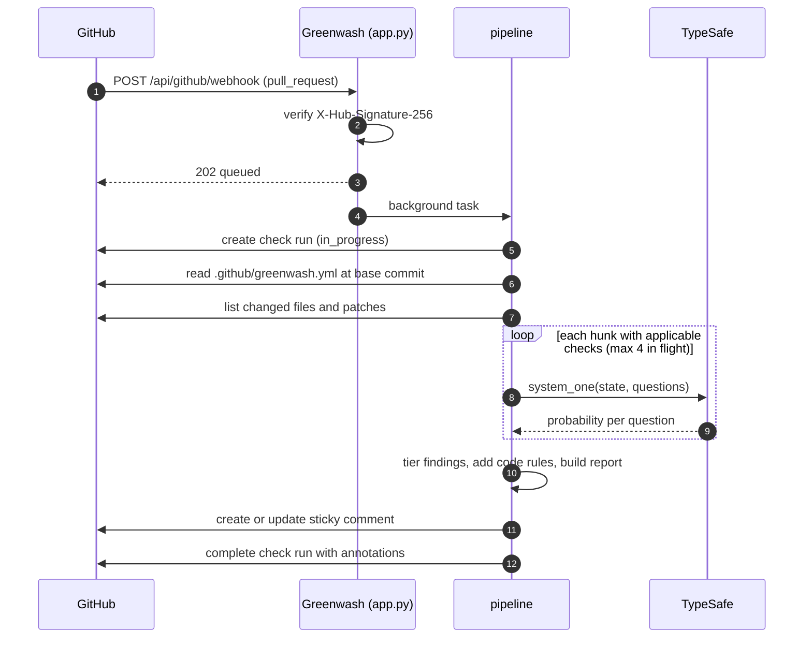

# Architecture

Greenwash is a small, stateless webhook service. GitHub tells it when a pull request changes, it
asks TypeSafe narrow yes/no questions about each changed hunk, and it writes the results back to
GitHub.

## Overview



### Sequence



## Request lifecycle

### 1. Receive the webhook — `app.py`, `webhook.py`

- The request body is verified against the `X-Hub-Signature-256` header using the webhook secret.
  Missing or invalid signatures get `401`.
- Only `pull_request` events with action `opened`, `synchronize`, `reopened`, or
  `ready_for_review`, on open pull requests, are processed. Everything else gets `202 ignored`.
- Greenwash replies `202 queued` immediately and runs the analysis as a background task, because
  GitHub stops waiting for a webhook response after 10 seconds.

### 2. Authenticate and start the check — `github.py`

- githubkit signs a short-lived JWT with the app's private key and exchanges it for an
  installation token scoped to the repository.
- A check run named `Greenwash` is created on the pull request's head commit with status
  `in_progress`.

### 3. Load configuration — `config.py`

- `.github/greenwash.yml` is read from the pull request's **base** commit. A pull request therefore
  cannot disable or weaken the checks that apply to itself.
- A missing file means defaults. An invalid file also falls back to defaults, and the error is
  shown in the report.

### 4. Build hunks — `diff.py`

- Changed files matching `ignore_paths` are dropped.
- Each file is classified from its path alone: `test`, `snapshot`, `ci`, `lint_config`, `source`, or
  `other`.
- Each file's patch is split at its `@@` headers. Greenwash tracks the new-file line number of
  every added line so findings can point at an exact line.
- Hunks longer than 8,000 characters are truncated and marked as truncated.

### 5. Ask TypeSafe — `checks.py`, `judge.py`, `analyze.py`

- Each hunk gets only the checks whose `applies_to` includes its file kind. A hunk in `other` files
  (such as Markdown) gets no request at all.
- All of a hunk's questions go out in **one** request. TypeSafe answers them independently and in
  parallel, so adding a question doesn't change the others' answers.
- At most 4 requests are in flight at once, and at most 300 hunks are analyzed per pull request.
- Every answer is a probability that the problem is present:
  - **flagged** — at or above the check's threshold (default `0.8`)
  - **worth a second look** — at least `0.5` and below the threshold
  - dropped — below `0.5`

### 6. Add code-rule findings — `checks.py`

Two findings need no model:

- `deleted_test_file` — a test file was removed.
- `snapshot_without_source_change` — snapshot or golden files changed but no source file did.

### 7. Report and publish — `report.py`, `github.py`

- **Conclusion:** `success` when nothing is flagged, `neutral` when something is flagged, and
  `failure` only when `mode: check` is set and a critical finding is flagged.
- **Annotations:** up to 50, for flagged findings with a line number, most severe first.
- **Comment:** one sticky comment, identified by a hidden `<!-- greenwash:report -->` marker and
  updated in place on each push.
- **Errors:** if anything fails after the check run starts, the check completes as `neutral` with
  the error message. Greenwash never blocks a merge because of its own failure.

## Anatomy of one TypeSafe request

For a hunk that loosens an assertion in `tests/test_diff.py`:

```python
state = {
    "pull_request": {"title": "Fix flaky diff tests", "description": "..."},
    "hunk": {
        "file_path": "tests/test_diff.py",
        "file_kind": "test",
        "header": "@@ -50,4 +50,4 @@ def test_parse_patch_splits_hunks...",
        "diff_legend": "Lines starting with '-' were removed, lines starting with '+' were added, ...",
        "diff": "-    assert first.added_lines == (11,)\n+    assert first.added_lines",
        "truncated": False,
    },
}

questions = {  # one Noul per applicable check
    "weakened_assertion": Noul(instructions="Does `hunk.diff` delete a test assertion, or replace it ...", criteria=...),
    "skipped_test": Noul(...),
    "rewritten_expectation": Noul(...),
    "suppressed_check": Noul(...),
}

# response.nouls -> {"weakened_assertion": 0.98, "skipped_test": 0.56, ...}
```

`0.98` is flagged as a critical annotation on the added line. `0.56` is listed under *Worth a
second look*.

## Module map

| Module | Responsibility | External calls |
|---|---|---|
| `app.py` | HTTP routes: landing page, `/healthz`, webhook | receives HTTP |
| `webhook.py` | signature helper; event payload → `PullRequest` | — |
| `settings.py` | environment variables | — |
| `pipeline.py` | orchestrates one pull request | via the two ports |
| `github.py` | `GitHubPort` protocol and githubkit adapter | GitHub REST API |
| `judge.py` | `Judge` protocol, request building, TypeSafe adapter | TypeSafe API |
| `diff.py` | file classification, patch parsing | — |
| `config.py` | config parsing and path ignoring | — |
| `checks.py` | built-in checks, custom rules, code rules | — |
| `analyze.py` | concurrency, tiers, statistics | — |
| `report.py` | conclusion, annotations, Markdown | — |
| `models.py` | shared frozen data classes | — |

## Design choices

- **Ports at the edges.** GitHub and TypeSafe sit behind `GitHubPort` and `Judge`. Everything else is
  plain logic, so the unit tests run without network access, using fakes that record what would
  have been published.
- **Narrow questions.** Each check decides one fact about one hunk. Broad questions such as "is this
  change suspicious?" hide several judgments behind one number and are hard to tune.
- **Policy in code, judgment in the model.** Thresholds, tiers, and conclusions are deterministic
  code, so behavior is reviewable and changing a threshold never needs a model call.
- **No generated text.** The model only returns probabilities. Every word in a report comes from
  Greenwash's templates or from the pull request itself.
- **Stateless.** Configuration lives in each repository and results live on GitHub, so there is no
  database to run.

## Testing layers

| Layer | Command | Network |
|---|---|---|
| Unit tests | `uv run pytest` | none |
| End-to-end with real TypeSafe and a fake GitHub | `uv run pytest -m live` | TypeSafe |
| Labeled evaluation set | `uv run python -m evals.run_evals` | TypeSafe |
