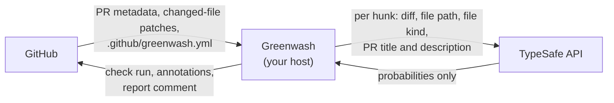

# Privacy and data handling

Greenwash reads pull requests on repositories where you install it. This page describes exactly
what it reads, what leaves your infrastructure, and what is stored.

## What Greenwash reads from GitHub

- The pull request's number, title, description, and head and base commit SHAs.
- The list of changed files and their patches (the diff). Greenwash does not fetch full file
  contents.
- `.github/greenwash.yml` at the base commit, if it exists.
- Existing comments on the pull request, only to find and update its own report comment.

## What is sent to TypeSafe

For each changed hunk that has at least one applicable check:

- the hunk's diff text (truncated to 8,000 characters)
- the file path and the file kind Greenwash assigned to it
- the pull request title and description
- the check questions

Files whose kind is `other` (for example Markdown or images) and files matching `ignore_paths` are
never sent. TypeSafe returns only probabilities. Review TypeSafe's own terms and data policies
before using Greenwash on sensitive code.

## What is stored

Nothing. Greenwash has no database and keeps no files. Results are written to GitHub as a check
run and a pull request comment, and remain under GitHub's access controls.

The service logs one summary line per analyzed pull request (repository, pull request number,
conclusion, number of findings and hunks, input token count, and model name). It does not log
diffs, pull request text, or credentials.

## Credentials

Greenwash needs three secrets: the GitHub App private key, the webhook secret, and a TypeSafe API
key. Keep them in your host's secret store. See [SECURITY.md](../SECURITY.md) for guidance.
