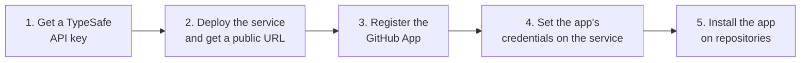

# Self-hosting

This guide takes you from nothing to Greenwash reviewing pull requests on your repositories.



## Requirements

- A [TypeSafe API key](https://console.typesafe.ai/settings/keys).
- A host that keeps a process running and exposes a public HTTPS URL — for example Railway, Render,
  Fly.io, or a container on your own server.
- A GitHub account (personal or organization) to register the app under.

> **Why an always-on host?** Greenwash replies to each webhook immediately and finishes the
> analysis in a background task. Serverless platforms that freeze or stop the process after the
> response is sent can cut that work short.

## Environment variables

| Variable | Required | Description |
|---|---|---|
| `TYPESAFE_API_KEY` | yes | TypeSafe API key. |
| `GITHUB_APP_ID` | yes | The GitHub App's numeric App ID. |
| `GITHUB_PRIVATE_KEY` | yes | The app's PEM private key. Literal `\n` sequences are converted to newlines, so single-line values work too. |
| `GITHUB_WEBHOOK_SECRET` | yes | The webhook secret you set on the GitHub App. |
| `GITHUB_APP_SLUG` | no | The app's URL slug, used for the install link on the landing page. Default: `greenwash`. |
| `TYPESAFE_MODEL` | no | Model override, for example `jev-preview`. Default: `jev-latest`. |
| `PORT` | no | Port to listen on inside the container. Default: `8000`. |

A template is in [`.env.example`](../.env.example).

The service won't start until all required variables are set. If you deploy before registering the
GitHub App (you need the public URL to register it), set temporary placeholder values for the
three `GITHUB_*` variables and replace them in step 4.

## Step 1 — Generate a webhook secret

```bash
openssl rand -hex 32
```

Keep it somewhere safe. You'll set it both on your host (`GITHUB_WEBHOOK_SECRET`) and on the
GitHub App.

## Step 2 — Deploy the service

### Option A: Docker (any host)

```bash
docker build -t greenwash .
docker run -p 8000:8000 \
  -e TYPESAFE_API_KEY=... \
  -e GITHUB_APP_ID=... \
  -e GITHUB_PRIVATE_KEY="$(cat path/to/private-key.pem)" \
  -e GITHUB_WEBHOOK_SECRET=... \
  -e GITHUB_APP_SLUG=... \
  greenwash
```

Put it behind HTTPS and note the public URL.

### Option B: Railway

With the [Railway CLI](https://docs.railway.com/cli) installed:

```bash
railway login
railway init --name greenwash
railway add --service greenwash
railway domain --service greenwash            # prints your public URL

printf "%s" "$TYPESAFE_API_KEY" | railway variable set TYPESAFE_API_KEY --stdin --service greenwash --skip-deploys
printf "%s" "$WEBHOOK_SECRET"   | railway variable set GITHUB_WEBHOOK_SECRET --stdin --service greenwash --skip-deploys
railway variable set GITHUB_APP_ID=pending GITHUB_PRIVATE_KEY=pending --service greenwash --skip-deploys

railway environment edit --service-config greenwash deploy.healthcheckPath /healthz
railway up --service greenwash --ci -m "Deploy Greenwash"
```

Railway builds the included `Dockerfile` automatically.

### Check the deployment

```bash
curl https://<your-host>/healthz            # {"ok":true}
curl -X POST https://<your-host>/api/github/webhook -d '{}' -o /dev/null -w '%{http_code}\n'   # 401
```

## Step 3 — Register the GitHub App

Go to **GitHub → Settings → Developer settings → GitHub Apps → New GitHub App** (for an
organization: **Organization settings → Developer settings → GitHub Apps**).

| Field | Value |
|---|---|
| GitHub App name | Any unique name, for example `greenwash-yourname` |
| Homepage URL | `https://<your-host>` |
| Webhook → Active | checked |
| Webhook URL | `https://<your-host>/api/github/webhook` |
| Webhook secret | the secret from step 1 |
| Where can this GitHub App be installed? | **Only on this account** |

**Repository permissions** — leave everything else at *No access*:

| Permission | Access | Used for |
|---|---|---|
| Checks | Read and write | Creating the `Greenwash` check run and annotations |
| Contents | Read-only | Reading `.github/greenwash.yml` |
| Pull requests | Read and write | Listing changed files and posting the report comment |
| Metadata | Read-only | Required by GitHub |

**Subscribe to events:** Pull request.

Click **Create GitHub App**, then on the app's page:

1. Note the **App ID** and the slug from the page URL.
2. Under **Private keys**, click **Generate a private key** and save the `.pem` file.

## Step 4 — Set the app credentials

Replace the placeholders on your host with the real values:

```bash
railway variable set GITHUB_APP_ID=<app id> GITHUB_APP_SLUG=<slug> --service greenwash --skip-deploys
railway variable set GITHUB_PRIVATE_KEY --stdin --service greenwash < path/to/private-key.pem
```

The last command triggers a redeploy. After it finishes, the landing page at `https://<your-host>`
links to your app's install page. Store the `.pem` file somewhere safe, or delete it — you can
always generate a new key.

## Step 5 — Install and try it

1. Open `https://github.com/apps/<slug>/installations/new` and choose the repositories.
2. Open a pull request that weakens an assertion, for example `assert total == 6` → `assert total`.
3. Within a few seconds the pull request shows a **Greenwash** check and a report comment.

Every analyzed pull request uses your TypeSafe quota, so install the app only on repositories you
want reviewed.

## Local development

To run the service on your machine against a real GitHub App, forward webhooks with
[smee.io](https://smee.io):

1. Create a channel at <https://smee.io> and use its URL as the app's **Webhook URL** (use a
   separate development app so production keeps working).
2. Forward events to your machine:

   ```bash
   npx smee-client --url https://smee.io/<channel> --target http://127.0.0.1:8000/api/github/webhook
   ```

3. Start the server with the development app's credentials exported:

   ```bash
   uv run uvicorn greenwash.app:create_app --factory --port 8000 --reload
   ```

To test the webhook endpoint without GitHub, send a signed sample event:

```bash
GITHUB_WEBHOOK_SECRET=... uv run python scripts/replay_webhook.py \
  tests/fixtures/pull_request_opened.json http://127.0.0.1:8000/api/github/webhook
```

The sample points at a repository that doesn't exist, so after the `202` response the server logs
that it could not process the pull request. That's expected.

## Troubleshooting

| Symptom | Likely cause |
|---|---|
| No check appears on pull requests | The app isn't installed on that repository, or the **Pull request** event isn't subscribed. Check **Recent Deliveries** under the app's **Advanced** settings. |
| Deliveries show `401` | `GITHUB_WEBHOOK_SECRET` doesn't match the secret on the GitHub App. |
| The check says *Greenwash could not finish* | Read the error in the check summary. Authentication errors usually mean a wrong `GITHUB_APP_ID` or `GITHUB_PRIVATE_KEY`. |
| The service won't start | A required environment variable is missing; the startup error lists which. |
| Findings on files you don't care about | Add them to `ignore_paths` in `.github/greenwash.yml`. |
